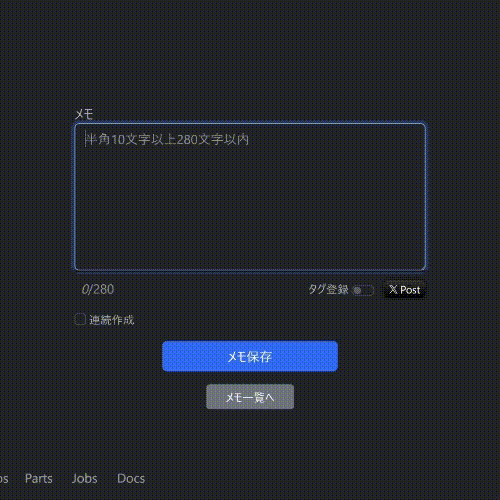
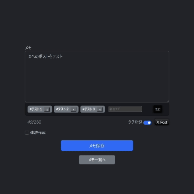

# memo2doc

## 概要

短文メモから生成AIを利用して文書を作成するウェブアプリです。個人の研究学習用に作成しました。

## 特徴

- 短文メモを作成、ついでにXへポストも可能[^1]
- 作成した短文メモを組み合わせて自動で文書を生成
- OpenAIのAPIを利用
- Laravelのプラグインを別途インストールせずに開発
- Bootstrap5(外部読込)を利用したレスポンシブデザイン
- Vanilla Javascript使用  

<a href="https://memodoc.joyrswd.com/about#begining"></a>
<a href="https://memodoc.joyrswd.com/about#xpost"></a>

## 開発環境
- Docker Desktop 4.12.0
- Ubuntu 22.04.3 LTS（Windows 11 WSL上）
- PHP 8.3.1 (cli)
    - Composer 2.6.6
    - Laravel Framework 10.35.0 [^2]
- MariaDB 11.2.2
- Apache 2.4.58  

[^1]: 文字数はX準拠の半角280文字まで（タグと連動）
[^2]: composer install実行で自動的にインストールされます  

開発環境構築用のリポジトリも下記で公開しています。  
https://github.com/joyrswd/memodoc-dev-environment


## システム構成

- [サイト概要](docs/outline.md) docs/outline.md
- [データベース構成](docs/database.md) docs/database.md
- [クラス構成](docs/class.md) docs/class.md

## インストール

1. 上記と同等の環境を用意
2. ＜ドキュメントルート＞に本リポジトリをクローンする
3. composer installを実行してvendorディレクトリを生成する
4. .env.exampleをコピーし.envにリネームする
5. php artisan key:generateを実行してアプリケーションキーを生成する
6. .envのadmin関係の環境変数を設定する
    ```bash
    ADMIN_USER_NAME= #任意のユーザー名（3文字以上、半角英数_-のみ利用可能）
    ADMIN_USER_PASSWORD= #任意のパスワード（8文字以上、半角英数記号のみ利用可能）
    ADMIN_USER_EMAIL=  #任意のメールアドレス
    ```
7. その他データベースやメールサーバーなどの.envを環境に応じた値に編集する
8. /config/api.php.exampleをコピーして/config/api.phpにリネームする
9. 上記のapi.php内のopenai.secretを編集する（ご自身でAPIキーを発行してください）
10. バックグラウンドジョブを定時実行させるため、cronに下記のコマンドを設定する 
    ```bash
    # （＜ドキュメントルート＞の部分はご自身の環境に読み替えてください）
    * * * * * cd ＜ドキュメントルート＞ && php artisan schedule:run >> /dev/null 2>&1
    ```
11. ＜ドキュメントルート＞でLaravelのmigrationを実行しデータベースを構築する
    ```bash
    php artisan migrate --seed
    ```
12. ブラウザでサイトトップページを開き、6.で設定したADMIN_USER_NAMEとADMIN_USER_PASSWORDでログインできることを確認する

以上

<details>

<summary>Tips</summary>

- Laravel Sailを使用する場合、laravelコンテナにcronとCLIエディタをインストールする必要がある。
    ```bash
    # cronとCLIエディタのインストール
    apt-get update
    apt-get install cron vim
    # cronの設定コマンド(実行後CLIエディタが起動)
    crontab -e
    # cronの設定確認
    crontab -l
    # cronの起動
    /etc/init.d/cron start
    ```
- storageでパーミッションエラーが出る場合は所有権を変更する
    ```bash
    chmod 777 -R ./storage
    ```
</details>

## デモサイト
https://memodoc.joyrswd.com/

サイトの利用方法と注意事項は下記をご参照ください。  
https://memodoc.joyrswd.com/about

## 今後の開発予定
（順不同）
- ユーザー毎API利用回数制限機能
- 他の生成AIのAPI導入
- 文書生成時にメモのタグの内容を意識させる
- 削除データの表示、復元機能
- ユーザー管理機能
- 多言語対応

## ライセンス

このプロジェクトは[MITライセンス](LICENSE)の下でライセンスされています。

