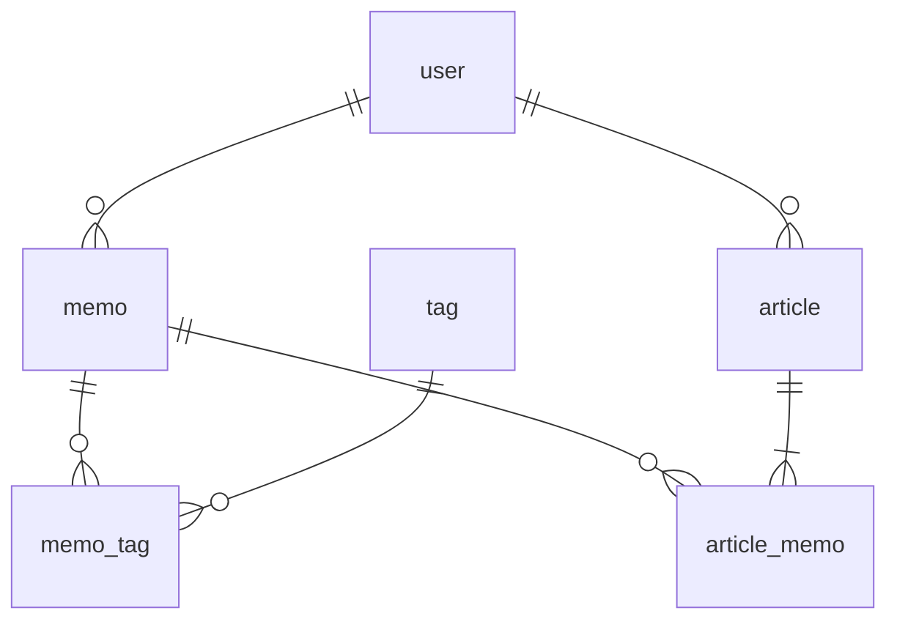

## ER図

## テーブル定義書

### テーブル名: users

| 列名       | データ型     | 制約           | 説明         |
|------------|--------------|----------------|--------------|
| id         | INT          | PK             | ユーザーID   |
| name       | VARCHAR(255) | NOT NULL       | ユーザー名（半角英数字_-のみ）   |
| password   | VARCHAR(255) | NOT NULL       | パスワード   |
| created_at | timestamp    | DEFAULT current_timestamp   | 作成日時     |
| updated_at | timestamp    | DEFAULT NULL   | 更新日時     |
| deleted_at | timestamp    | DEFAULT NULL   | 削除日時     |

### テーブル名: memos

| 列名       | データ型     | 制約           | 説明         |
|------------|--------------|----------------|--------------|
| id         | INT          | PK             | メモID       |
| content    | TEXT         | NOT NULL       | 内容         |
| user_id    | INT          | FK             | ユーザーID   |
| created_at | timestamp    | DEFAULT current_timestamp   | 作成日時     |
| updated_at | timestamp    | DEFAULT NULL   | 更新日時     |
| deleted_at | timestamp    | DEFAULT NULL   | 削除日時     |

### テーブル名: tags

| 列名       | データ型     | 制約           | 説明         |
|------------|--------------|----------------|--------------|
| id         | INT          | PK             | タグID       |
| name       | VARCHAR(20)  | NOT NULL       | タグ名       |
| created_at | DATETIME     | DEFAULT NULL   | 作成日時     |

### テーブル名: docs

| 列名       | データ型     | 制約           | 説明         |
|------------|--------------|----------------|--------------|
| id         | INT          | PK             | 記事ID       |
| title      | VARCHAR(255) | NOT NULL       | タイトル     |
| content    | TEXT         | NOT NULL       | 内容         |
| user_id    | INT          | FK             | ユーザーID   |
| created_at | timestamp    | DEFAULT current_timestamp   | 作成日時     |
| updated_at | timestamp    | DEFAULT NULL   | 更新日時     |
| deleted_at | timestamp    | DEFAULT NULL   | 削除日時     |

### テーブル名: memo_tag

| 列名       | データ型     | 制約           | 説明         |
|------------|--------------|----------------|--------------|
| memo_id    | INT          | FK             | メモID       |
| tag_id     | INT          | FK             | タグID       |

### テーブル名: doc_memo

| 列名       | データ型     | 制約           | 説明         |
|------------|--------------|----------------|--------------|
| article_id | INT          | FK             | 記事ID       |
| memo_id    | INT          | FK             | メモID       |

