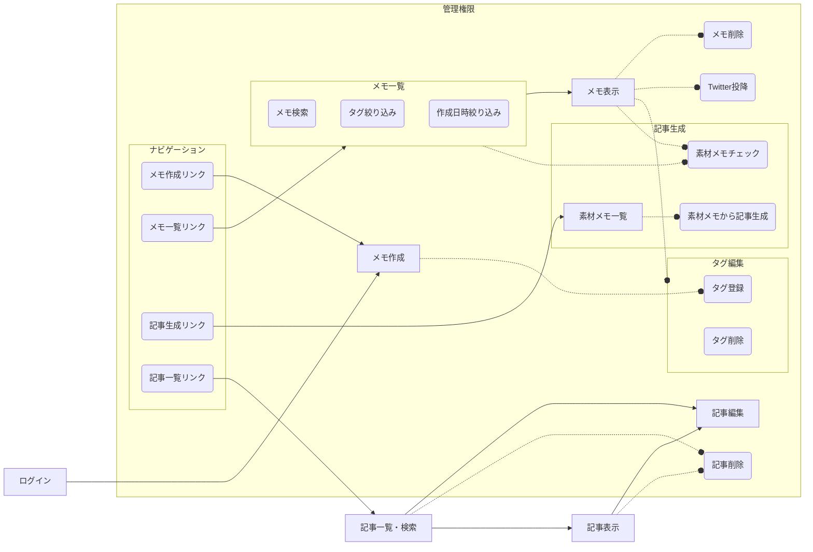

# 開発計画
短文メモからブログ記事を生成するサービスを作成する

## 要求
- 日々の思い付きや考察をメモとして保存したい
- メモは作成と削除のみで投降後の変更はできないようにしたい
- メモはTwitterにも投稿できるようにしたい
- いつ何のメモを取ったかカレンダーから振り返れるようにしたい
- タグ付けでメモを検索絞り込みできるようにしたい
- 過去のメモの内容を組み合わせて1つの記事を作成したい

## 要件定義
- ユーザー認証機能
    - ユーザーはアカウントを作成し、ログインすることができる
    - ログインしたユーザーのみがメモの作成、削除などの操作を行える
    - ユーザーはパスワードの変更やアカウントの削除ができる
- メモの作成
    - メモのタイトルと内容を入力できるフォームを提供する
    - 入力されたメモはデータベースに保存される
- メモの削除
    - メモ一覧から削除したいメモを選択し、削除ボタンを押す
    - 選択されたメモはデータベースから論理削除される
- タグ付け機能
    - メモ投稿時にタグ付けをしてデータベースに保存できる
    - メモ投降後でもタグの変更は行える
    - タグは日本語20文字までとする
- メモの一覧検索
    - 今までに投降したメモが作成日時降順で表示される
    - 任意のキーワードでメモを絞り込むことができる
    - タグでメモを絞り込むことができる
- メモのTwitter投稿機能
    - メモ一覧から投稿したいメモを選択し、Twitter投稿ボタンを押す
    - 選択されたメモはTwitterに投稿される
- 過去のメモの内容を組み合わせて記事を作成する機能
    - 一覧、検索画面などで記事生成の素材にしたいメモをチェックする
    - チェックされたメモの一覧画面で、順番などを調整して生成ボタンを押す
    - メモの内容が組み合わされ新しい記事が作成される

## 画面遷移図

