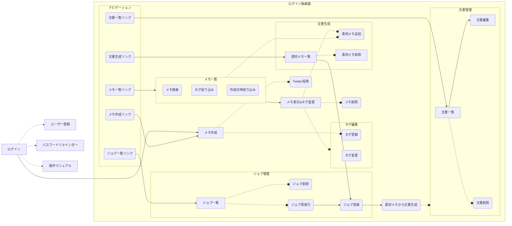

# 開発計画
短文メモからブログ文書を生成するサービスを作成する

## 要求
- 日々の思い付きや考察をメモとして保存したい
- メモは作成と削除のみで投降後の変更はできないようにしたい
- メモはTwitterにも投稿できるようにしたい
- いつ何のメモを取ったか検索できるようにしたい
- タグ付けでメモを検索絞り込みできるようにしたい
- 過去のメモの内容を組み合わせて1つの文書を作成したい
- 文書はメモからの自動生成のみで任意作成はできないようにする

## 要件
- ユーザー認証機能
    - ユーザー作成画面からユーザー作成を行える
    - ユーザーはパスワードの再設定を行える
    - ユーザーのメールアドレスは一度存在確認が行われる
- メモの作成
    - メモのタイトルと内容を入力できるフォームを提供する
    - 入力されたメモはデータベースに保存される
    - メモ作成後にtwitterに投稿できるようにする
    - メモの内容はtwitter準拠の文字数制限にする
- メモの削除
    - メモ一覧から削除したいメモを選択し、削除ボタンを押す
    - 選択されたメモはデータベースから論理削除される
- タグ付け機能
    - メモ投稿時にタグ付けをしてデータベースに保存できる
    - メモ投降後でもタグの変更は行える
    - タグは20文字までとする
    - 記号のは使用不可とする
- メモの一覧検索
    - 今までに自身が投降したメモが作成日時降順で表示される
    - 任意のキーワードでメモを絞り込むことができる
    - タグでメモを絞り込むことができる
- メモの内容を組み合わせて文書を作成する機能
    - 一覧、検索画面などで文書生成の素材にしたいメモをチェックする
    - チェックされたメモの一覧画面で、順番などを調整して生成ボタンを押す
    - メモの内容が組み合わされ新しい文書が作成される
    - タイトルも自動生成されるようにする
- 時間がかかる文書生成をバックグラウンド処理にする
    - 文書生成をバックグラウンドジョブ（キュー処理）にする
    - 処理の進捗がわかる画面を用意する
    - 処理に失敗した場合再実行できるようにする
- 文書一覧検索機能
    - 文書のタイトルから検索できるようにする
    - 文書の本文から検索できるようにする
    - 文書の作成日時から検索できるようにする
- 文書編集機能
    - 文書のタイトルを編集する機能
    - 文書の本文を編集する機能

## 画面遷移図

