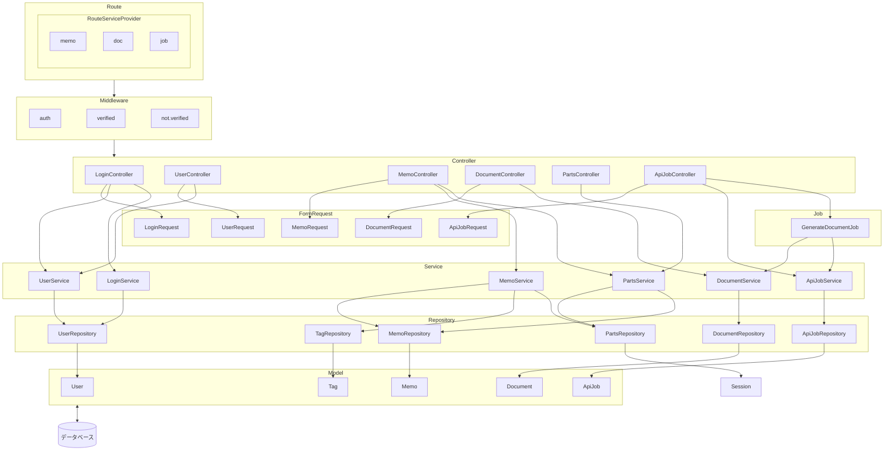

# クラス構成
## クラス相関図

## 機能リスト
＊＝未実装
### RouteServiceProvider
- **{memo}** -- memosテーブル内のレコード存在確認と所有権確認を行う
- **{doc}** -- documentsテーブル内のレコード存在確認と所有権確認を行う
- **{job}** -- api_jobsテーブル内のレコード存在確認と所有権確認を行う
- **{token}** -- メールリセットリンクのトークンの妥当性を判定

### Middleware
- **auth** -- ログイン認証の確認を行う
- **verified** -- メール認証済みかを確認する
- **not.verified** -- メール未認証かを確認する

### Controller
#### LoginController
| 機能名       | リクエスト     | URI           | 機能概要         |
|------------|--------------|----------------|--------------|
|ログイン入力|GET|/|ユーザー名入力枠表示  パスワード入力枠表示|
|ログイン認証|POST|/login/|アカウント情報認証  認可|
|ログアウト|GET|/logout/|ログイン中ユーザーのログアウト|
|パスワード再設定|GET|/password/request|メールアドレス入力枠表示|
|再設定メール|POST|/password/email|再設定メール送信|
|新パスワード入力|GET|/password/reset/{token}|パスワード入力枠表示  パスワード入力枠表示|
|新パスワード登録|POST|/password/reset|新パスワード保存|
|マニュアル表示|GET|/about|サイト概要と操作方法の説明|

#### UserController
| 機能名       | リクエスト     | URI           | 機能概要         |
|------------|--------------|----------------|--------------|
|新規ユーザー入力|GET|/user/create|ユーザー名入力枠表示  メールアドレス入力枠表示  パスワード入力枠表示     確認パスワード入力枠表示|
|新規ユーザー登録|POST|/user/|ユーザー名保存     パスワード保存   メールアドレス保存   ユーザーID採番|
|＊ユーザー一覧|GET|/user/|ユーザー名表示  削除ボタン表示   編集リンク設置   ユーザー名検索   削除済み表示/非表示切り替え|
|＊ユーザー削除|DELETE|/user/{user}|指定ユーザーIDの論理削除|
|＊ユーザー編集|GET|/user/{user}/edit|ユーザー名表示   パスワード入力枠表示     確認パスワード入力枠表示|
|＊ユーザー更新|PUT|/user/{user}|パスワード更新|

#### MemoController
| 機能名       | リクエスト     | URI           | 機能概要         |
|------------|--------------|----------------|--------------|
|新規メモ入力|GET|/memo/create|メモ内容入力枠表示   タグ登録枠表示メモ内容   連続投稿チェック表示   Xポストボタン表示   タグのXポスト連動機能   X準拠の文字数カウント|
|新規メモ登録|POST|/memo/|メモ内容保存   タグ登録   タグIDとメモIDの紐づけ|
|メモ削除|DELETE|/memo/{memo}|指定メモIDの論理削除|
|メモ一覧|GET|/memo/|内容前方30文字表示  タグ編集欄表示  作成日時表示  削除ボタン表示  内容検索  作成日時絞り込み  タグ絞り込み  ＊削除済み表示/非表示切り替え|
|メモ（タグ）更新|POST|/memo/{memo}/edit|タグIDとメモIDの紐づけ変更   Xポストボタン表示   タグのXポスト連動機能   X準拠の文字数カウント|

#### PartsController
| 機能名       | リクエスト     | URI           | 機能概要         |
|------------|--------------|----------------|--------------|
|素材メモ一覧|GET|/parts/|内容前方30文字表示  作成日時表示  ＊メモ順番調整機能  記事生成ボタン表示  カートから削除ボタン表示  カートを空にするボタン表示|
|素材メモ登録|PUT|/parts/{memo}|カート内限界数判定  素材となるメモをセッションに保存|
|素材メモ削除|DELETE|/parts/{memo}|素材となるメモをセッションから削除|
|素材メモ全削除|DELETE|/parts/|素材となるメモをセッションから全削除|
|素材メモ並び替え|POST|/parts/|素材メモの順番を並び替え|

#### ApiJobController
| 機能名       | リクエスト     | URI           | 機能概要|
|------------|--------------|----------------|--------------|
|ジョブ一覧|GET|/job/|作成日時表示  ジョブステータス表示  エラーメッセージ表示  生成文書タイトル（リンク）表示   削除ボタン表示   再実行ボタン表示   作成日時絞り込み   ステータス絞り込み|
|ジョブ登録|POST|/store/|パーツメモから文書生成するジョブ登録   パーツを空にする|
|ジョブ削除|DELETE|/job/{job}|指定ジョブIDの論理削除|

#### DocumentController
| 機能名       | リクエスト     | URI           | 機能概要         |
|------------|--------------|----------------|--------------|
|新規記事生成|POST|/doc/|素材メモから記事を生成 素材メモの限界数判定|
|＊記事表示|GET|/doc/{doc}/show|記事タイトル表示   記事内容表示   作成日時表示|
|記事削除|DELETE|/doc/{doc}|指定記事IDの論理削除|
|記事一覧|GET|/doc/|タイトル表示  作成日時表示  削除ボタン表示  タイトル検索   内容検索  作成日時絞り込み  ＊削除済み表示/非表示切り替え|
|記事編集|GET|/doc/{doc}/edit|記事タイトル入力枠表示   記事内容入力枠表示|
|記事更新|PUT|/doc/{doc}|記事タイトル更新   記事内容更新|

### ジョブ
#### GenerateDocumentJob
ジョブに登録されたメモから、生成AIのAPIを利用して1つの文書を作成。  
文書はタイトルと本文で構成されるように指示。

### FormRequest
#### LoginRequest
- **name**
    - 未入力チェック
    - 文字種チェック（半角英数字_-のみ）
    - 文字数チェック（~255）
- **password**
    - 未入力チェック
    - 文字種チェック（半角英数字記号のみ）
    - 文字数チェック（8~255）
- **email**
    - 未入力チェック
    - メール形式チェック
    - 文字数チェック（~255）
    - 存在チェック

#### UserRequest
- **user_name**
    - 未入力チェック
    - 文字種チェック（半角英数字_-のみ）
    - 文字数チェック（3~255）
    - 重複チェック
- **users_password**
    - 未入力チェック
    - 文字種チェック（半角英数字記号のみ）
    - 文字数チェック（8~255）
    - 確認と同一チェック
- **users_email**
    - 未入力チェック
    - メール形式チェック
    - 文字数チェック（~255）
    - 重複チェック

#### MemoRequest
- **memo_content**
    - 未入力チェック
    - 最大文字数チェック（~280, タグ含むX準拠でカウント）
    - 最少文字数チェック（10~, 全角半角問わず）
- **tags.＊**
    - 未入力チェック（GET以外でhas_tagにチェックがある場合）
    - 文字種チェック（半角全角記号、半角全角スペース不可）
    - 文字数チェック（~20）

#### ApiJobRequest
- **generate**
    - セッションからメモIDの配列を取得
    - memosとしてバリデーションを通す
- **regenerate**
    - 再作成可能なジョブステータスか確認
    - ジョブIDからメモIDの配列を取得
    - memosとしてバリデーションを通す
- **memos**
    - 未入力チェック
    - 数値チェック
    - メモの存在チェック
    - メモの所有権チェック

#### DocumentRequest
- **doc_title**
    - 未入力チェック
    - 文字数チェック（~255）
- **doc_content**
    - 未入力チェック
    - 文字数チェック（5~）
